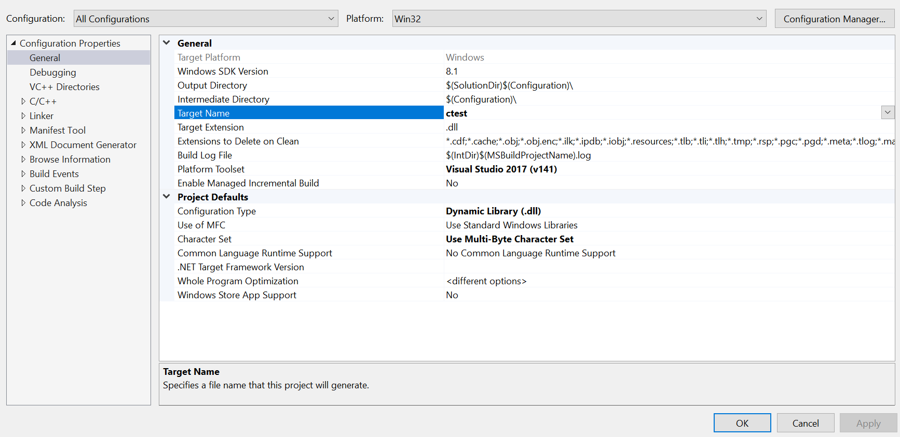
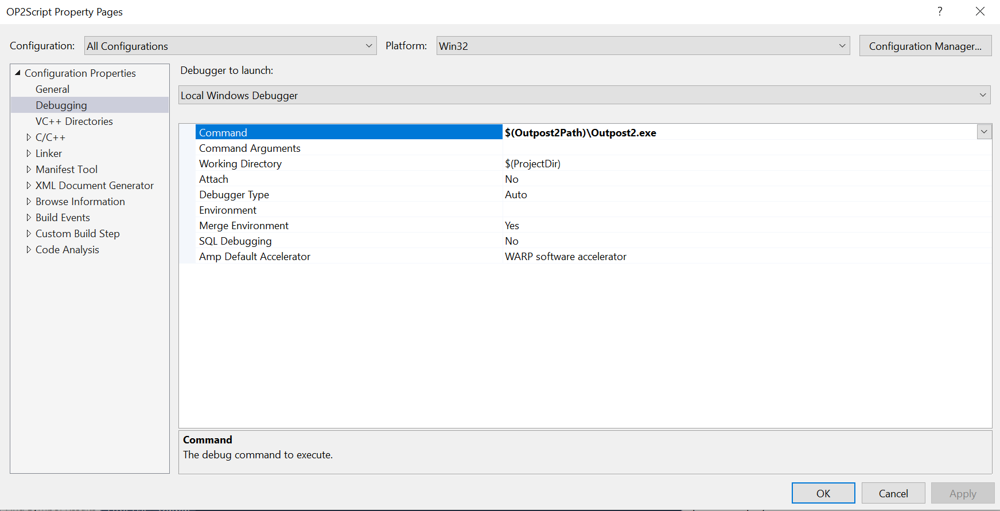

# LevelTemplate

Outpost 2 Level template project for use in creating new Outpost 2 missions.

Missions in Outpost 2 are implemented as DLL (Dynamic Link Library) files. These contain executable code. They are typically produced by a C++ compiler, such as Microsoft Visual C++ (MSVC), included as part of [Visual Studio](https://visualstudio.microsoft.com/). The Visual Studio Community Edition is a free download, albeit a bit hefty in size. The MSVC compiler component of Visual Studio is required to build Outpost 2 missions. Be sure to select the C++ toolset when installing.

## Downloading

The LevelTemplate project and all dependencies can be downloaded from GitHub. The recommended way is with a recursive Git clone operation. A recursive Git clone will download the project and all dependent projects, place all dependent projects in their proper folders, and ensure you have consistent versions of all dependencies. Visual Studio has a built in Git client. If you'd like an alternative, [TortoiseGit](https://tortoisegit.org/) can also be used. If you'd prefer a command line client, you can use [Git for Windows](https://gitforwindows.org/).

Example Git clone (command line client):
```
git clone --recursive https://github.com/OutpostUniverse/LevelTemplate.git
```

If you clone without the recursive option, you may find the Git submodule folders for the dependencies are empty. To recover from this, it's possible to download the dependencies later by running:
```
git submodule update --init --recursive
```

If you'd like to skip using a Git client, it is possible to download ZIP files from GitHub. However, you would need to download each dependent project separately, and be sure to unpack all ZIP files to the proper folder. You might also need to download specific versions of each project to avoid incompatibilities caused by version skew between the dependent projects. Using a Git client with recursive clone will avoid all this hassle. The dependencies are:
 * [OP2MissionSDK](https://github.com/OutpostUniverse/OP2MissionSDK)
 * [Outpost2DLL](https://github.com/OutpostUniverse/Outpost2DLL)
 * [OP2Helper](https://github.com/OutpostUniverse/OP2Helper)
 * [HFL](https://github.com/OutpostUniverse/HFL)

## Usage

Open the main solution file in Visual Studio. Edit the project as desired. Set a DLL name. Compile the source code into a DLL file. Copy the DLL to the game folder. Run the game and test your level.

### Editing project source

Editing the source code will mainly involve changes to `LevelMain.cpp`, or any new files that you add. You may want to start by updating the `ExportLevelDetails` data. Following that, you may want to add to `InitProc` to set initial colony conditions, initial units, victory/failure conditions, and setup disasters or other custom trigger events. At this point it would help to consult a tutorial and look at example code to know what to do. Some example code can be found in the [HoovilleLevelTutorial](https://github.com/OutpostUniverse/HoovilleLevelTutorial) project. You may also want to check the programming section of [Outpost Universe Forums](https://forum.outpost2.net/). In particular, Sirbomber wrote a number of [Outpost 2 Coding 101/201 tutorials](https://forum.outpost2.net/index.php/board,103.0.html). You may also find information on the [Outpost Universe Wiki](https://wiki.outpost2.net/doku.php) about Mission Coding, or the Outpost 2 SDK (Software Development Kit).

### Naming the DLL

You'll want to set project settings for the output DLL name. To use the DLL with Outpost2.exe you'll need to follow certain naming conventions. The DLL name is restricted to a base name of 7 characters or less, plus the extension. If the base name exceeds 7 characters, you may see duplicate entries in the games list within Outpost 2. Additionally, you will need to set a name prefix for the level to appear in the correct list of games. This prefix should match the settings from the `ExportLevelDetails` data. The prefix is not case sensitive.

DLL name prefix table:
 * eXX - Eden campaign mission number XX
 * pXX - Plymouth campaign mission number XX
 * tXX - Tutorial mission number XX
 * a - Auto demo (when idle at main menu)
 * c - Colony game
 * mlX - Multiplayer, last-one-standing, for up to X players
 * mfX - Multiplayer, space race, for up to X players
 * muX - Multiplayer, land rush, for up to X players
 * mrX - Multiplayer, resource race, for up to X players
 * mmX - Multiplayer, midas, for up to X players

Examples:
 * cLevel.dll - Colony game (base name has 6 characters)
 * e01.dll - Eden campaign mission 01 (base name has 3 characters)
 * p12.dll - Plymouth campaign mission 12
 * ademo1.dll - Auto-demo number 1
 * CES1.dll - Colony (Eden Starship 1)



### Compiling the DLL

Select build or compile from the Visual Studio menu, or use the corresponding toolbar button or hotkey (F5). It should take a moment to compile the code into a DLL file. If there are errors or warnings, they will show up at the bottom. You will need to fix any errors before a DLL is produced. A DLL can still be produced when there are warnings, but there is a good chance the code is wrong, so warnings should be fixed anyway. If you get errors sometimes you'll get lots of cascaded errors. In this case, look at the first one, it may be causing the other errors to be reported in what is otherwise good code. The fastest way to fix errors is usually to search the error message online. Good C++ resources or tutorials may help. [Stackoverflow](https://stackoverflow.com/) typically has lots of good answers. If nothing generic helps, or the problem is hard to search for, it may be best to post a question on [Outpost Universe Forums](https://forum.outpost2.net/). In particular, if you find a bug in the LevelTemplate code, or the MissionSDK, or find documentation is lacking, wrong, or hard to follow, we would love to hear about it. Our efforts are largely dependent on what people ask about.

### Copying the DLL to the game folder

Once you have a DLL file, it needs to be copied to the Outpost 2 folder. Optionally, as part of the build, Visual Studio can be configured to automatically copy the DLL to the Outpost 2 folder. Copying the DLL is controlled by a post-build step. The TemplateProject comes pre-configured with a post-build step to copy the DLL, provided it finds an `Outpost2Path` environment variable. As each person may store their copy of Outpost 2 in a different folder, the post build step depends on this environment variable to find it. As a benefit, if you set an environment variable once on your system, it will be usable by all level projects, without further configuration. Check Google for how to set an environment variable on Windows.

### Running the level

Run and test the level by starting Outpost 2 and loading the mission. To start Outpost 2 from Visual Studio, you may configure a debugging command within the project settings. This allows for much faster testing without having to switch out of the Visual Studio environment and navigating to the game folder. A good setting might be: `$(Outpost2Path)\Outpost2.exe`. Unfortunately, the debugging command setting is part of the project's user settings, which contains computer specific data and so are not typically stored in version control. As such, the debugging command setting must be setup manually for each project. Once set though, and in combination with the output name setting and the `Outpost2Path` environment variable, you will be able to compile, copy, and run the game with a single hotkey.



## Alternative Compilers

Currently we have not succeeded in compiling the LevelTemplate nor MissionSDK code with compilers other than Microsoft Visual C++. On Win32, there is no standard C++ ABI (Application Binary Interface), which is needed for compiled C++ code from different compilers to interoperate. In particular, one of the aspects of an ABI is name mangling. The exports from Outpost2.exe are mainly C++ class member function exports using MSVC name mangling. Using a compiler such as Mingw would produce different name mangling, and so would be unable to link with Outpost2.exe functions. The Clang compiler may be able to match the MSVC ABI, including name mangling, and may even be usable from other platforms such as Linux or MacOS. So far though, we have not succeeded in getting it to work.

Alternative IDEs are a possibility, assuming they can integrate with the MSVC compiler. In particular, if you don't wish to run Visual Studio, you may alternatively use [Code::Blocks](http://www.codeblocks.org/). Code::Blocks comes with easy MSVC compiler integration, though the two must be downloaded separately.
